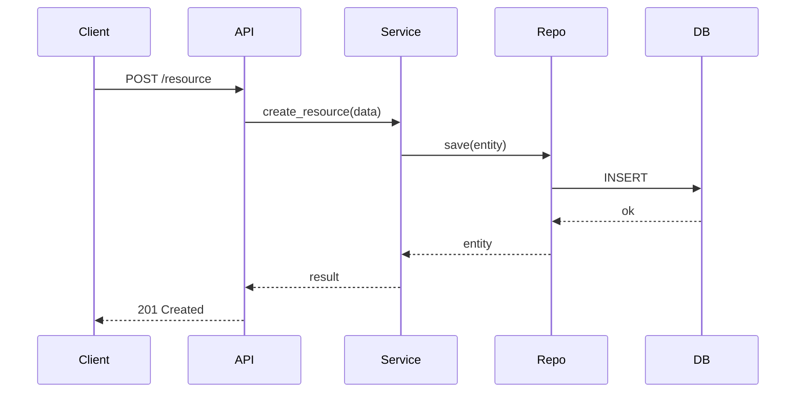

<!-- AGENT: Do not read during exploration. This template is used only when creating specs. Read .claude/docs/scaffold-overview.md instead. -->
# Design: [Title]

**Author**: [name]
**Date**: [YYYY-MM-DD]
**Status**: [draft | review | approved | superseded]
**Spec**: [link to specs/features/feature-name.md]

## Context and Problem

What is the problem we're solving? Why does it matter now?

## Decision

The chosen approach. Be specific about what we will build and how.

## Alternatives Considered

### Alternative A: [Name]

- **Pros**: ...
- **Cons**: ...
- **Why rejected**: ...

### Alternative B: [Name]

- **Pros**: ...
- **Cons**: ...
- **Why rejected**: ...

## Layer Impact Analysis

| Layer | Impacted? | Changes |
|-------|-----------|---------|
| Types | Yes/No | [description] |
| Config | Yes/No | [description] |
| Repo | Yes/No | [description] |
| Service | Yes/No | [description] |
| Runtime | Yes/No | [description] |
| UI | Yes/No | [description] |

## API Contract

```
METHOD /api/path
Request: { ... }
Response: { ... }
Errors: 4xx/5xx scenarios
```

## Data Model Changes

```python
# New or modified models
```

## Sequence Diagram



## Risks and Mitigations

| Risk | Likelihood | Impact | Mitigation |
|------|------------|--------|------------|
| [risk] | Low/Med/High | Low/Med/High | [mitigation] |

## Test Plan Summary

- **Unit**: [key scenarios to unit test]
- **Integration**: [cross-layer scenarios]
- **E2E**: [user-facing flows]
- **Performance**: [load/stress targets]
